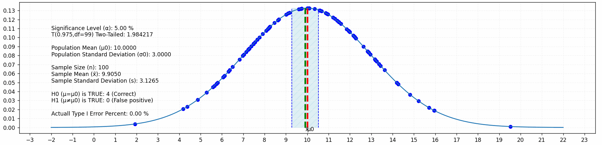
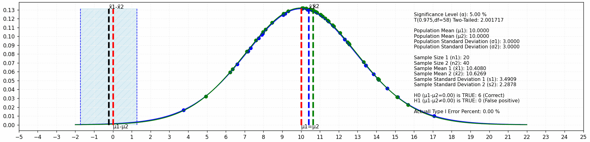
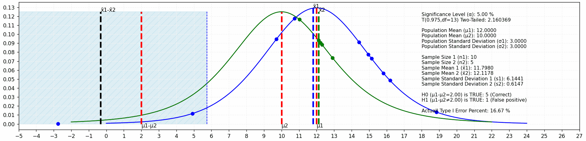
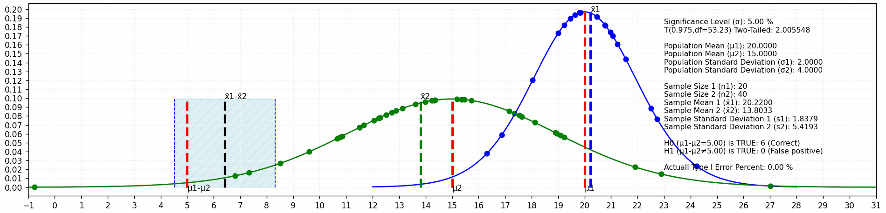

# Test Statistics

(The test numbering matches the numbering in the book ["100 Statistical Tests 3rd Edition"](https://books.google.com/books?id=c16MhjA4pHgC) by [Gopal K Kanji](https://en.wikipedia.org/wiki/Gopal_Kanji))

* [01. Z-test for a population mean (variance known)](#z-test-for-a-population-mean-variance-known)
* [03. Z-test for two population means (variances known and unequal)](#z-test-for-two-population-means-variances-known-and-unequal)
* [04. Z-test for a proportion (binomial distribution)](#z-test-for-a-proportion-binomial-distribution)
* [05. Z-test for the equality of two proportions (binomial distribution)](#z-test-for-the-equality-of-two-proportions-binomial-distribution)
* [07. t-test for a population mean (variance unknown)](#t-test-for-a-population-mean-variance-unknown)
* [08. t-test for two population means (variances unknown but equal)](#t-test-for-two-population-means-variances-unknown-but-equal)
* [09. t-test for two population means (variances unknown and unequal)](#t-test-for-two-population-means-variances-unknown-and-unequal)
* [15. χ2-test for a population variance](#χ2-test-for-a-population-variance)
* [16. F-test for two population variances (variance ratio test)](#f-test-for-two-population-variances-variance-ratio-test)
* [22. F-test for K population means (analysis of variance)](#f-test-for-k-population-means-analysis-of-variance)

## Z-test for a population mean (variance known)

* Sample Size n=5
  
* Sample Size n=20
  
* Sample Size n=100
  

## Z-test for two population means (variances known and unequal)

* μ1 = μ2 = 10, σ1 = σ2 = 4
  * n1=10, n2=5
    
  * n1=20, n2=40
    
  * n1=200, n2=100
    
* μ1 = 15, μ2 = 10, σ1 = 2, σ2 = 4
  * n1=10, n2=5
    
  * n1=20, n2=40
    
  * n1=200, n2=100
    

## Z-test for a proportion (binomial distribution)

* Sample Size n=40
  
* Sample Size n=200
  
* Sample Size n=1000
  

## Z-test for the equality of two proportions (binomial distribution)

* n1=40, n2=100
  
* n1=200, n2=400
  
* n1=1000, n2=500
  

## t-test for a population mean (variance unknown)

* Sample Size n=5
  
* Sample Size n=20
  
* Sample Size n=100
  

## t-test for two population means (variances unknown but equal)

* μ1 = μ2 = 10, σ1 = σ2 = 3
  * n1=10, n2=5
    
  * n1=20, n2=40
    
  * n1=200, n2=100
    
* μ1 = 12, μ2 = 10, σ1 = σ2 = 3
  * n1=10, n2=5
    
  * n1=20, n2=40
    
  * n1=200, n2=100
    

## t-test for two population means (variances unknown and unequal)

* μ1 = μ2 = 10, σ1 = 2, σ2 = 4
  * n1=10, n2=5
    
  * n1=20, n2=40
    
  * n1=200, n2=100
    
* μ1 = 20, μ2 = 15, σ1 = 2, σ2 = 4
  * n1=10, n2=5
    
  * n1=20, n2=40
    
  * n1=200, n2=100
    

## χ2-test for a population variance

* Sample Size n=5
  
* Sample Size n=20
  
* Sample Size n=100
  

## F-test for two population variances (variance ratio test)

* μ1 = 10, μ2 = 15, σ1 = σ2 = 2
  * n1=10, n2=5
    
  * n1=20, n2=40
    
  * n1=200, n2=100
    

## F-test for K population means (analysis of variance)

* μ1 = μ2 = μ3 = μ4 = 10
  * n1=5, n2=10, n3=15, n4=20
    
  * n1=50, n2=100, n3=150, n4=200
    

* μ1 = 25, μ2 = 20, μ3 = 15, μ4 = 10
  * n1=5, n2=10, n3=15, n4=20
    

# License

This project is available under the [MIT license](LICENSE) © Nail Sharipov